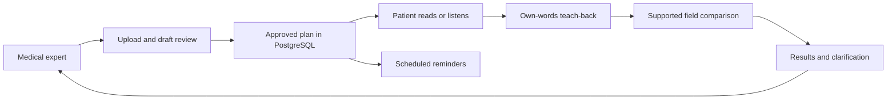

# CareBodha

**Understand your care. Follow it with confidence.**

Developed by **Team Inferno** for **HackOverflow 10.0**, conducted by **NIT Durgapur**.

[Visit the working prototype](https://carebodha.vercel.app/)


## The idea

A prescription is only useful when a patient understands it. Medicine quantities, schedules, unfamiliar terminology, follow-up instructions, and language barriers can make an existing care plan difficult to follow. Care teams also need to understand which details the patient understood and which need clarification.

CareBodha connects **doctor-approved instructions, accessible reading and listening, and teach-back** in one application. Patients explain their understanding in their own words. The app compares supported details with the approved care plan and identifies matching answers, conflicts, missing information, and questions that require clinician review.

Our goal is clearer communication between patients, medical experts, and trusted family members. CareBodha explains an existing care plan; it does not diagnose, prescribe, or replace clinical judgment.

## How it works

1. An authorized medical expert connects a registered patient by email or username.
2. The expert uploads a PDF/image or enters instruction text. Extraction creates drafts and structured fields.
3. The clinician reviews medicine names, doses, units, frequency, timing, duration, and explanations, then publishes an approved version.
4. The patient reads or listens to the published care instructions.
5. The patient explains their understanding by typing or supported browser voice transcription.
6. CareBodha checks supported fields, records the result, and supports clarification, follow-up visits, and reminders.

## Features

| Patients and family | Medical experts |
| --- | --- |
| Overview and approved care plans | Assigned patients and patient connection |
| Language selection and read-aloud instructions | Private document uploads and extraction review |
| Own-words teach-back with supported automatic checks | Draft explanations and reviewed publication |
| Follow-up visits and medicine reminders | Teach-back review and clarification queue |
| Revocable family assistance permissions | Versioned plans and approval history |
| Notifications and language/access settings | Access restricted to assigned records |

### Accounts

Routine sign-in uses an **email or username and CareBodha password**. New patient accounts verify their mobile number by **OTP** and choose a password of at least 12 characters. Forgotten-password recovery sends an OTP only to the registered, verified phone number. Existing phone-only accounts can use recovery to set their first password.

Medical-expert accounts require administrator provisioning. Public patient registration cannot grant clinician access. Configured Twilio Verify handles phone verification; trial accounts may restrict delivery to provider-verified numbers.

### Languages and audio

The interface supports **English, Hindi, Bengali, Odia, Telugu, Punjabi, and Tamil**. Reading/listening uses reviewed explanations or the published instruction. Supported medication phrases can be localized with a fixed vocabulary that preserves names and quantities. Complex instructions without a reviewed translation retain complete approved English wording so warnings are not discarded.

Native browser voices are used when available; configured **Sarvam** speech generation provides audio fallback. Transcription depends on browser support and microphone permission. Audio support and availability of a reviewed translation are separate capabilities.

### Care and privacy boundaries

- Extraction creates drafts; clinician approval is required before publication.
- Missing fields remain missing rather than being guessed.
- Teach-back checks understanding of supported details. A match is not proof of adherence or medical safety; unsupported or ambiguous answers may require review.
- Patients see approved care instructions, not original uploaded document pages or source-document panels. Authorized clinicians retain source access for review.
- Plan versions preserve history. Changes require a new reviewed version.
- Family permissions are checked on the server and can be revoked. Family answers remain separate from patient answers.
- Reminders use approved instructions and user-selected schedules. In-app notifications are supported; SMS reminders require a separately configured messaging service. Twilio Verify alone does not send medicine reminders.

## Technology and architecture

**Frontend:** Next.js 16, React, TypeScript, shared responsive styles, and Three.js landing visuals with reduced-motion support.

**Backend:** Next.js route handlers, Better Auth, Prisma, PostgreSQL, private storage, and background processing.

**Document processing:** PDF text extraction, optional Tesseract OCR, structured extraction, and clinician review.

**Hosted deployment:** Vercel, hosted PostgreSQL, private Vercel Blob storage, and durable Workflow jobs. Local development uses a separate worker and private filesystem storage.



## Run locally

Use **Node.js 24**, pnpm, and PostgreSQL. Install Chrome for Playwright checks.

```powershell
pnpm install --frozen-lockfile
pnpm setup:env
pnpm db:generate
```

Start PostgreSQL with Docker or keep the included helper running in another terminal:

```powershell
docker compose up -d postgres
# Alternative:
pnpm db:local
```

Initialize the normal environment and start the web app:

```powershell
pnpm setup:normal
pnpm dev
```

Run the worker in a separate terminal:

```powershell
pnpm worker
```

Open [localhost:3000](http://localhost:3000). `BETTER_AUTH_URL` must match the browser origin. `scripts/pnpm.ps1` provides a pnpm wrapper for the Codex Windows environment.

## Configuration

Keep credentials in ignored `.env` files or deployment environment variables.

| Capability | Configuration |
| --- | --- |
| Database and sessions | `DATABASE_URL`, `BETTER_AUTH_URL`, `BETTER_AUTH_SECRET`, `APP_MODE` |
| Local private storage | `STORAGE_DRIVER=local`, `PRIVATE_STORAGE_PATH` |
| Hosted storage | `STORAGE_DRIVER=vercel-blob` and a connected private Blob store |
| OCR and optional AI adapter | `OCR_ENABLED`, `AI_PROVIDER`, optional `AI_BASE_URL`, `AI_MODEL`, `AI_API_KEY` |
| Sarvam speech | `TTS_PROVIDER=sarvam`, `SARVAM_API_KEY` |
| Phone verification and recovery | `PHONE_OTP_PROVIDER=twilio-verify`, `TWILIO_ACCOUNT_SID`, `TWILIO_AUTH_TOKEN`, `TWILIO_VERIFY_SERVICE_SID` |
| Optional SMS medicine reminders | `SMS_PROVIDER=twilio`, account credentials, `TWILIO_MESSAGING_SERVICE_SID` |

The Vercel build generates Prisma, applies migrations, initializes the hosted environment, and builds the app. Never commit API keys, patient documents, credentials, or database exports.

## Verification and fictional fixtures

```powershell
pnpm typecheck
pnpm test
pnpm build
pnpm verify:normal
```

Run database/browser workflows only against isolated test databases. Phone lifecycle tests use `PHONE_AUTH_TEST_DATABASE_URL` pointing to local `carebodha_normal_test` and a simulated SMS provider; they do not establish handset delivery. Multilingual checks cover medication reading, audio routing, and supported teach-back details in all seven languages.

Optional local fictional doctors and prescriptions:

```powershell
pnpm exec tsx scripts/provision-test-doctors.ts
pnpm exec tsx scripts/provision-test-prescriptions.ts
```

Fixtures are for testing, never actual patient care. Credentials are stored in ignored local files. See [sample prescriptions](docs/sample-prescriptions/README.md), [API documentation](docs/API.md), and [verification notes](docs/VERIFICATION.md). Historical notes may describe earlier prototype behavior; the current implementation is authoritative.

## Team and event

**Team Inferno developed CareBodha for HackOverflow 10.0, conducted by NIT Durgapur.**

CareBodha is a working hackathon prototype. Clinical validation, security/privacy review, and applicable operational requirements remain necessary before real-world healthcare deployment.
